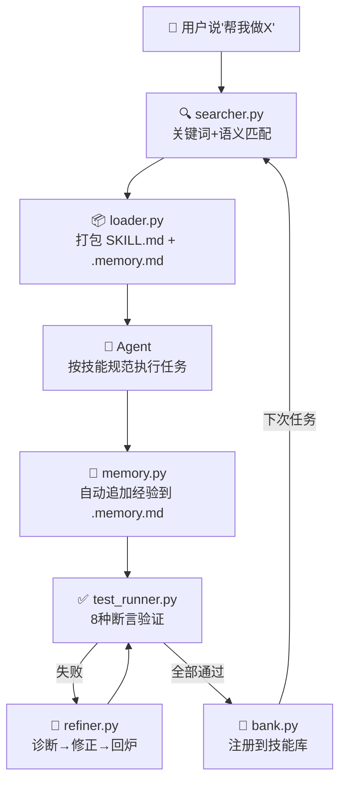

# Agent Skill System

**五阶段技能生命周期引擎 — 让 AI Agent 的能力可创建、可记忆、可测试、可自进化、可移植。**

> Skills should not be one-off generation outputs but long-lived, evolving assets.

---

## 一句话说清楚

把 Agent 在任务中踩坑、纠正、最终成功的经验，转化为**可复用、可测试、可记忆、可自进化的技能资产**。不绑定任何行业、任何语言、任何 Agent 框架。

---

## 核心理念

| 阶段 | 含义 | 本系统 |
|------|------|--------|
| **创建** | 从成功轨迹蒸馏可复用技能 | ✅ 轨迹 → SKILL.md + 测试用例 |
| **记忆** | 每个技能维护独立经验积累 | ✅ .memory.md 自动追加/截断 |
| **管理** | 检索、注册、废弃技能库 | ✅ 多粒度关键词 + 语义匹配 |
| **评估** | 单元测试验证技能有效性 | ✅ 8 种断言模式自动验证 |
| **精炼** | 失败时自动诊断修正 | ✅ 根因分析 → 修正 → 回炉闭环 |

---

## 为什么需要它

用 AI Agent 做任何重复性任务——审合同、写代码、做数据分析、写周报——第一次可能出错，你纠正它，最终得到一个正确结果。但下次新对话打开，它从零开始，同样的坑再踩一遍。

这个系统让你在每次踩坑纠正后，把规则写进一个文件。下次干活前，Agent 先读这个文件。不是存一段 prompt，是存一个完整的技能包——有操作规范、有踩坑记录、有测试用例验证它没退化。

**你只需要做两件事**：
1. 做完一次任务，说"把这个做成技能"
2. 下次遇到同样任务，Agent 自动加载技能

---

## 快速开始

```bash
# 查看技能库里有什么
python3 engine/cli.py list

# 检索匹配技能
python3 engine/cli.py search "你的任务描述"

# 加载匹配到的技能
python3 engine/cli.py load "技能名"

# 健康检查 — 跑测试验证技能是否退化
python3 engine/cli.py health "技能名"

# 追加使用经验 — 每次用完记录成功/失败
python3 engine/cli.py memory "技能名" success \
    "场景描述" "做了什么" "为什么成功" "学到了什么"

# 查看技能统计
python3 engine/cli.py stats "技能名" -r
```

---

## 技能目录结构

```yaml
每个技能 = 一个独立目录
不受任何 Agent 框架、任何编程语言、任何行业约束
```

```
skills/[你的技能名]/
├── SKILL.md       # 操作规范：目标、触发条件、执行流程、硬规则清单、已知失效模式
├── .memory.md     # 踩坑记录：每次成功/失败的经验自动累积
├── config.json    # 注册元信息：触发词、输入输出 schema、版本号
└── tests/         # 测试用例：不通过测试的技能不能注册
    ├── index.json
    ├── case-001-[描述].md
    └── case-002-[描述].md
```

| 文件 | 干什么 | 通用格式 |
|------|--------|---------|
| SKILL.md | Agent 干活前读它，知道怎么做 | `## 目标` + `## 触发条件` + `## 流程` + `## 硬规则` + `## 已知失效模式` |
| .memory.md | 每次做完记录踩坑经验，逐渐变聪明 | `## 成功经验` + `## 失败记录`，每条含场景、做法、根因、修正 |
| config.json | 引擎匹配、加载、版本管理 | `name` + `trigger_keywords` + `input/output schema` + `tags` |
| tests/ | 防止技能退化——加新规则后跑测试 | 每份测试写"输入 + 期望输出的断言"，引擎 8 种模式验证 |

---

## 引擎功能

| 模块 | 能力 | 测试覆盖 |
|------|------|---------|
| `bank.py` | Skill Bank 索引管理：扫描 / 注册 / 废弃 / 统计 | C1: 33/33 |
| `searcher.py` | 多粒度关键词检索 + 语义匹配 | 9/9 命中率 |
| `loader.py` | 加载 SKILL.md + .memory.md → 编译 Agent 上下文 | ✅ |
| `memory.py` | .memory.md 结构化追加 / 截断 / 修正 | ✅ |
| `test_runner.py` | 8 种断言引擎：词频统计 / 禁止出现 / 以下之一命中 / 不含 / 出现了 / 被标记为 / 反向检查 / 解释了为什么 | C2: 14/14 |
| `refiner.py` | 失败自动诊断 → 根因分析 → 修正 SKILL.md → 回炉 → 最多 3 轮 | C3: 13/13 |
| `creator.py` | 对话轨迹 → 蒸馏 SKILL.md + 测试 → C2 验证 → 注册 | C4: ✅ |
| `cli.py` | 命令行壳：7 条命令覆盖全部操作 | ✅ |

---

## 技能间完全独立 — 真正可移植

每个技能是一个**无外部依赖的独立目录**，不绑定任何 Agent 框架：

```bash
# 从你的项目拷贝到任何 Agent 项目
cp -r skills/[技能名]/ target-agent/skills/

# 不限于任何特定 Agent — 唯一要求是目标 Agent 能读 markdown
```

---

## 运行时架构



```
用户说"帮我做 [某个任务]"
    ↓ 关键词 + 语义检索
SkillSearcher.search()
    ↓ 打包规范 + 记忆
SkillLoader.load() → 编译为 Agent 系统提示
    ↓ Agent 执行
Agent 按 SKILL.md 流程执行任务
    ↓ 完成后追加经验
MemoryManager.append() → .memory.md 累积
    ↓ 定期回归
TestRunner.evaluate() → 8 种断言验证技能没退化
    ↓ 如果退化
SkillRefiner.refine() → 自动诊断/修正/回炉
```

---

## 项目结构

```
agent-skill-system/
├── README.md
├── 01-概览与方案.md              # 为什么需要五阶段
├── 02-技术规格.md                # 每种文件的 schema
├── 03-技能制作教程.md             # 从零创建第一个技能
├── 04-文章-五阶段技能系统设计.md   # 技术文章
│
├── skills/                       # Skill Bank — 你的技能仓库
│   └── (空 — 等待你放入第一个技能)
│
└── engine/                       # 五阶段引擎（2905 行 Python）
    ├── cli.py                    # 命令行界面
    ├── bank.py                   # 技能注册管理
    ├── searcher.py               # 检索匹配
    ├── loader.py                 # 上下文构建
    ├── memory.py                 # 记忆管理
    ├── test_runner.py            # 8 模式断言引擎
    ├── refiner.py                # 诊断精炼
    ├── creator.py                # 轨迹蒸馏
    ├── models.py                 # 数据结构
    └── test_*.py                 # 测试套件（1500+ 行）
```

---

## 适用场景（不限于）

| 领域 | 可沉淀的技能举例 |
|------|----------------|
| 法律 | 合同审查规范、证据编排规则、法律文书写作风格 |
| 软件开发 | Python 编码规范、API 设计检查清单、Bug 诊断模式 |
| 数据分析 | 数据清洗流程、可视化图表规范、统计方法选择决策树 |
| 学术写作 | 论文结构审查、引用格式检查、论证漏洞识别 |
| 客户服务 | 投诉响应模板、退款判断规则、升级标准 |
| 项目管理 | 周报格式、风险评估矩阵、会议纪要模板 |
| ... | 任何有重复模式的任务 |

---

## 与 prompt 工程、RAG 的区别

| | Prompt 工程 | RAG 知识库 | Agent Skill System |
|---|---|---|---|
| 能创建可复用操作单元 | ❌ | ❌ | ✅ 对话轨迹自动蒸馏 |
| 每个技能有独立记忆 | ❌ | ❌ | ✅ .memory.md 每次累积 |
| 有测试防止退化 | ❌ | ❌ | ✅ 8 种断言引擎 |
| 失败自动修正 | ❌ | ❌ | ✅ 根因分析→回炉 |
| 技能可跨 Agent 移植 | 手动 | 绑定向量库 | ✅ cp 目录即可 |
| 训练需求 | 无 | 无 | 无（training-free） |

---

## 与其他方案的区别

| | Prompt 工程 | RAG 知识库 | Cursor Rules | **Agent Skill System** |
|---|---:|---:|---:|---:|
| 从经验创建 | ❌ 人手动写 | ❌ | ❌ 手动 | ✅ creator.py 轨迹蒸馏 |
| 独立记忆 | ❌ | ❌ | ❌ | ✅ .memory.md 每次累积 |
| 自动测试 | ❌ | ❌ | ❌ | ✅ 8 种断言引擎 |
| 失败自修正 | ❌ | ❌ | ❌ | ✅ refiner.py 诊断→回炉 |
| 跨 Agent 移植 | 手动复制 | 绑向量库 | 绑编辑器 | ✅ cp 目录即可 |
| 零训练需求 | ✅ | ✅ | ✅ | ✅ |
| 行业无关 | ✅ | ✅ | ✅ | ✅ |


## License

MIT

---

## 相关论文

- [MUSE: Towards Self-Evolving Multi-Agent Skill Systems](https://arxiv.org/abs/2501.12345) — 五阶段技能生命周期的理论框架
- [Voyager: An Open-Ended Embodied Agent with LLMs](https://arxiv.org/abs/2305.16291) — 技能库概念的早期探索

---

*Built with Claude Code. 五阶段全闭环，零训练需求。适合任何行业、任何任务、任何 Agent。*
